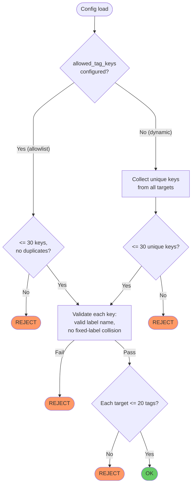

# Configuration Reference

See `config.example.yaml` for a complete working example.

## Example Config and Dashboard Sync

The `config.example.yaml` and `grafana/dashboards/shared/netsonar.json` are designed to work together out of the box. The example config uses a specific set of tag keys, and the dashboard expects those same keys as Prometheus labels to populate its columns:

| Tag Key in Config    | Dashboard Column | Description                                      |
|----------------------|------------------|--------------------------------------------------|
| `service`            | Service          | Logical service name (e.g. `api-pub`, `rds`)     |
| `scope`              | Scope            | Network scope (`same-region`, `cross-region`, `aws-regional`) |
| `impact`             | Impact           | Business impact level (`critical`, `high`, `medium`, `low`) |
| `target_region`      | Region           | Target's cloud region (e.g. `eu-central-1`)      |
| `target_partition`   | Partition        | Network partition (e.g. `global`, `china`)        |
| `target_account`     | Account          | Account or environment identifier                |

If you add, remove, or rename tag keys in your config, update the dashboard transformations accordingly — otherwise columns will appear empty or extra labels will be hidden.

The dashboard also references the `impact` label directly in the "Critical Failures" stat panel (`impact="critical"`). If you use different values for impact levels, update that PromQL query to match.

## Agent Settings

```yaml
agent:
  listen_addr: ":9275"          # HTTP listen address for /metrics; restart required to change
  metrics_path: "/metrics"      # Metrics endpoint path; restart required to change
  default_interval: 30s         # Default probe interval (applied when target omits interval)
  default_timeout: 5s           # Default probe timeout (applied when target omits timeout)
  initial_probe_jitter: 0s      # Random delay before first probe per target (0 disables)
  default_icmp_payload_sizes:   # Default ICMP payload sizes for MTU probes (descending)
    [1472, 1392, 1372, 1272, 1172, 1072]
  log_level: info               # Log level: debug, info, warn, error
  log_format: text              # Log format: text, json; restart required to change
  allowed_tag_keys:             # Optional: restrict tag keys to this allowlist
    - service
    - scope
    - impact
    - target_region
    - target_partition
    - target_account
```

When `allowed_tag_keys` contains entries, targets may only use tag keys from this list. When absent or empty, the agent collects tag keys dynamically from all targets (limited to 30 unique keys).

If `listen_addr` is omitted, it defaults to `:9275`. If `metrics_path` is
omitted, it defaults to `/metrics`. Both are startup-only; changing either
requires restarting the agent (SIGHUP reload will reject the change).

`initial_probe_jitter` defaults to `0s`. When set, each target waits a random
duration from `0` through `initial_probe_jitter` before its first probe after
startup or reload. Later probes keep their configured `interval`. The jitter
must not exceed the shortest effective target interval after defaults are
applied.

`log_format` defaults to `text`. Use `json` when logs are collected by systems
such as Loki, CloudWatch, Fluent Bit, or any pipeline that benefits from
structured fields. `log_level` can be changed with a SIGHUP reload, but
`log_format` is startup-only; changing it requires restarting the agent.

Text log example:

```text
level=WARN msg="probe failed" target_name=egress-proxy target=https://example.com probe_type=proxy duration=23ms error="proxy CONNECT returned status 407"
```

JSON log example:

```json
{"time":"2026-04-15T20:31:22.123456789Z","level":"WARN","msg":"probe failed","target_name":"egress-proxy","target":"https://example.com","probe_type":"proxy","duration":"23ms","error":"proxy CONNECT returned status 407"}
```

## Target Definition

```yaml
targets:
  - name: "api-gw-pub-eu"                                              # Unique identifier (required)
    address: "api-gw-pub.example.internal:443"                               # Target address (required)
    probe_type: tcp                                                     # Probe type (required)
    interval: 30s                                                       # Override agent default_interval
    timeout: 3s                                                         # Override agent default_timeout (must be ≤ interval)
    tags:                                                               # Prometheus labels (dynamic, max 20)
      service: api-gw-pub
      scope: same-region
      impact: critical
      target_region: eu-central-1
      target_partition: global
      target_account: ep-devops-eu1
    probe_opts:                                                         # Probe-type-specific options
      # (see Probe Types section)
```

### Dynamic Tags

Tag keys are not hardcoded in the agent binary. They are collected dynamically from the configuration at startup and used as Prometheus label names. See [Dynamic Labels](metrics.md#dynamic-labels) in the Metrics Reference for details.

When `allowed_tag_keys` is configured, only those keys are permitted — any target using a key outside the list is rejected at config load time. The allowlist itself is limited to **30 entries** (`MaxGlobalTagKeys`). When `allowed_tag_keys` is absent or empty, the agent collects keys dynamically from all targets, subject to the same safety limit of 30 unique keys. This cap exists because every unique tag key becomes a Prometheus label on every metric series, and high label cardinality degrades TSDB performance.

All tag keys (whether from the allowlist or collected dynamically) must be valid Prometheus label names (`[a-zA-Z_][a-zA-Z0-9_]*`) and must not collide with fixed labels (`target`, `target_name`, `probe_type`, `network_path`).



## Validation Rules

- Unknown YAML fields are rejected so typos fail at config load time
- `agent.metrics_path` must start with `/`, must be a plain path without whitespace, control characters, or ServeMux wildcards, and must not be `/healthz` or `/readyz`
- `name` must be unique across all targets
- `address` must be non-empty
- `probe_type` must be one of: `tcp`, `http`, `icmp`, `mtu`, `dns`, `tls_cert`, `http_body`, `proxy`
- After defaults are applied, `interval` must be > 0 (set `target.interval` or `agent.default_interval`)
- After defaults are applied, `timeout` must be > 0 (set `target.timeout` or `agent.default_timeout`)
- `timeout` must be ≤ `interval`
- `agent.initial_probe_jitter` must be ≥ 0 and must not exceed the shortest effective target interval
- `tags` must have at most 20 entries per target (the 4 fixed labels are not counted towards this limit)
- Tag keys must be valid Prometheus label names (`[a-zA-Z_][a-zA-Z0-9_]*`)
- Tag keys must not collide with fixed labels (`target`, `target_name`, `probe_type`, `network_path`)
- `allowed_tag_keys` must not contain duplicates and must not exceed 30 entries (`MaxGlobalTagKeys`)
- In dynamic mode (no allowlist), at most 30 unique tag keys across all targets (fixed labels excluded from this count)
- `icmp` and `mtu` reject literal IPv6 addresses because these probes currently use IPv4-only ICMP sockets
- `icmp_payload_sizes` must be sorted in descending order
- `dns_query_type` must be one of: `A`, `AAAA`, `CNAME`
- For `http` and `http_body`, `method` must be one of: `GET`, `HEAD`, `POST`; an empty value defaults to `GET`
- For `http` and `http_body`, every `expected_status_codes` value must be a valid HTTP status code in the range `100`-`599`; an empty list accepts any response that completes according to the probe's body-read semantics
- For `http`, `response_body_limit_bytes` must be >= 0. `0` or omitted uses the 1 MiB default; positive values set the capped response body read limit in bytes. Larger bodies do not fail the probe, and `probe_http_response_truncated` reports the truncation.
- Large `response_body_limit_bytes` values are legal but increase bandwidth usage and can lengthen `probe_duration_seconds` and `probe_phase_duration_seconds{phase="transfer"}` for large responses.
- For `http`, `request_body_bytes` must be >= 0 and <= 16777216 (16 MiB). `0` or omitted sends no generated request body; positive values require explicit `method: POST`.
- `request_body_bytes` is rejected for `http_body` and all non-HTTP probe types.
- For `http_body`, `body_match_regex` must be a valid Go regular expression
- `proxy_url` is required when `probe_type` is `proxy`; optional for `http`, `http_body`, and `tls_cert`; rejected when non-empty for `tcp`, `icmp`, `mtu`, and `dns`
- When set, `proxy_url` must be `http://[user:pass@]host[:port]` or `https://[user:pass@]host[:port]`; paths other than `/`, query strings, fragments, invalid ports, relative URLs, and non-HTTP schemes are rejected
- If `proxy_url` includes `user:pass@`, the credentials are used for proxy Basic authentication; `proxy` and `tls_cert` probes over `network_path="proxy"` send them as `Proxy-Authorization` on the CONNECT request
- Skipping TLS verification for HTTPS proxies is not supported. `tls_skip_verify` applies to the target TLS connection, not to the proxy's own TLS certificate.
- `mtu_retries` must be ≥ 1 when specified
- `mtu_per_attempt_timeout` must be > 0 and ≤ `timeout` when specified
- `icmp_payload_sizes` values must be > 0
- `expected_min_mtu` must be > 0; defaults to `largest_payload + 28` when not set
