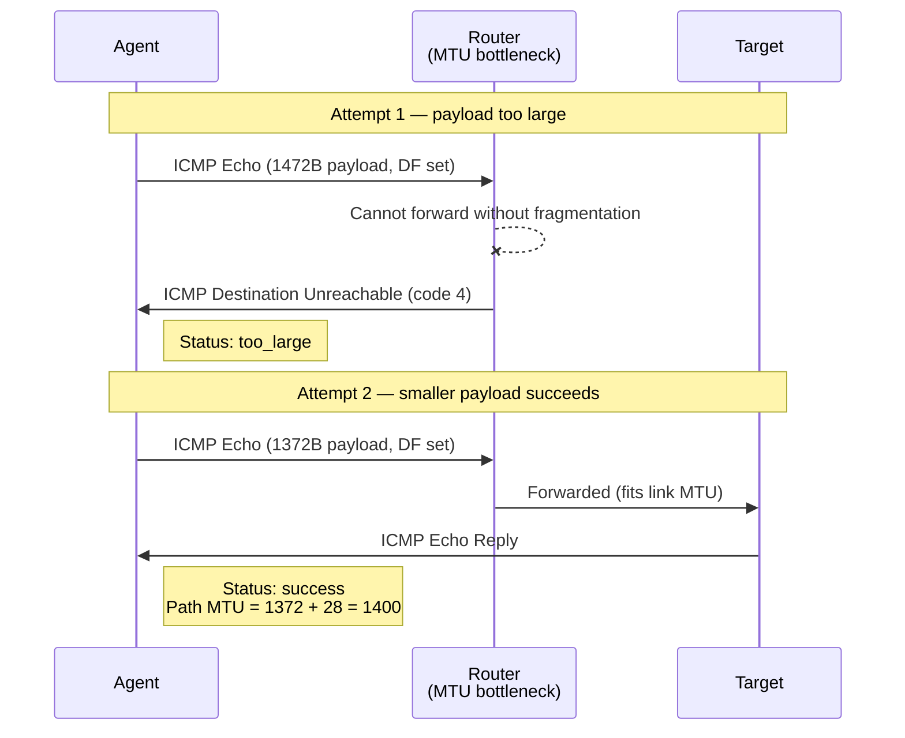
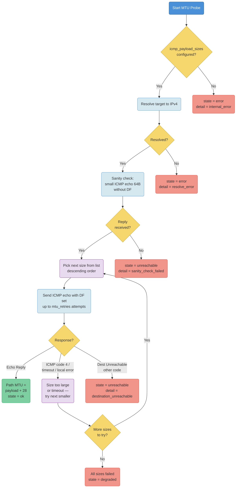
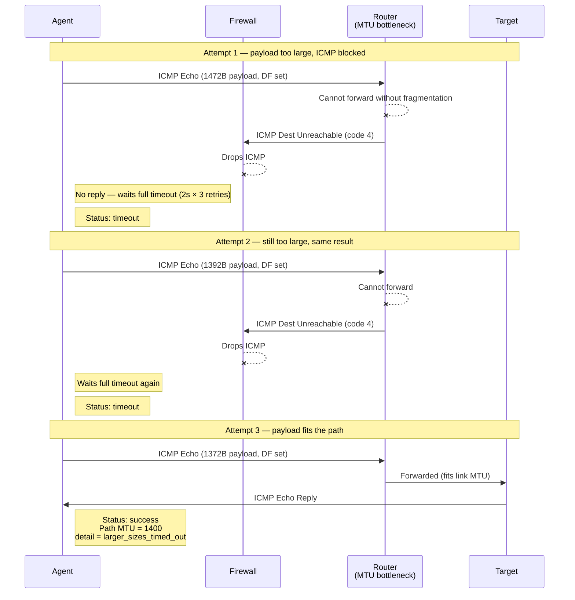

# MTU and PMTUD Probing Guide

## Table of Contents

- [Overview](#overview)
- [What MTU Means](#what-mtu-means)
- [How PMTUD Works](#how-pmtud-works)
- [How the Agent Implements MTU Probes](#how-the-agent-implements-mtu-probes)
- [ICMP Destination Unreachable Codes](#icmp-destination-unreachable-codes)
- [Common PMTUD Problems](#common-pmtud-problems)
- [Interpreting Results](#interpreting-results)
- [Configuration Examples](#configuration-examples)
- [Troubleshooting](#troubleshooting)

## Overview

The `mtu` probe estimates the largest IPv4 packet size that can cross the path between the agent and a target without fragmentation. It uses ICMP echo requests with the IPv4 Don't Fragment bit set, then steps down through configured payload sizes until one succeeds.

This probe is useful for finding path MTU problems across tunnels, VPNs, cloud networking, firewalls, NAT gateways, cross-region links, and private connectivity paths.

The current implementation is IPv4-only.

[Back to Table of Contents](#table-of-contents)

## What MTU Means

MTU means Maximum Transmission Unit. It is the largest packet size, in bytes, that can pass over a network link without fragmentation.

Common examples:

| Network path | Common MTU |
|---|---:|
| Standard Ethernet | 1500 |
| Some VPN or overlay paths | 1400 or lower |
| Jumbo-frame LAN paths | 9000, when enabled end to end |

For this agent's IPv4 ICMP probes:

```text
path MTU = ICMP payload size + 8 byte ICMP header + 20 byte IPv4 header
```

So an ICMP payload of `1472` corresponds to a path MTU of `1500`.

[Back to Table of Contents](#table-of-contents)

## How PMTUD Works

Path MTU Discovery tries to discover the largest packet size that can traverse the whole route to a target.

For IPv4, the sender can set the DF bit, short for Don't Fragment. If a packet with DF set is too large for a link on the path, a router should drop the packet and return an ICMP Destination Unreachable message with code `4`, meaning fragmentation was needed but DF was set.

The normal flow is:



When a packet gets through and the agent receives an ICMP echo reply, that payload size is considered successful.

[Back to Table of Contents](#table-of-contents)

## How the Agent Implements MTU Probes



The agent's `mtu` probe:

- resolves the target as IPv4,
- opens a raw IPv4 ICMP socket,
- sends a small ICMP echo sanity check before MTU tests,
- enables IPv4 DF probing with `IP_MTU_DISCOVER` and `IP_PMTUDISC_PROBE`,
- sends ICMP echo requests with configured payload sizes,
- tests sizes in descending order,
- retries each sanity and MTU attempt according to `mtu_retries`,
- stops at the first successful echo reply,
- reports the successful payload plus 28 bytes as the largest confirmed MTU.

`IP_PMTUDISC_PROBE` tells the Linux kernel to send DF probes without blocking the send only because of a cached PMTU value. The agent still interprets replies itself.

The sanity check uses a small ICMP echo without `IP_PMTUDISC_PROBE`. If it fails, the agent does not run DF MTU tests because the ICMP echo path is not usable enough for MTU probing.

Default payload sizes:

```yaml
default_icmp_payload_sizes: [1472, 1392, 1372, 1272, 1172, 1072]
```

These correspond to path MTUs:

| ICMP payload | Path MTU |
|---:|---:|
| 1472 | 1500 |
| 1392 | 1420 |
| 1372 | 1400 |
| 1272 | 1300 |
| 1172 | 1200 |
| 1072 | 1100 |

The probe requires `CAP_NET_RAW` or root because it uses raw ICMP sockets.

[Back to Table of Contents](#table-of-contents)

## ICMP Destination Unreachable Codes

ICMPv4 Destination Unreachable is a broad message type. The code determines the real cause.

Examples:

| Code | Meaning | PMTUD interpretation |
|---:|---|---|
| 0 | Network unreachable | Network or routing failure |
| 1 | Host unreachable | Target or routing failure |
| 3 | Port unreachable | Not a packet-size signal |
| 4 | Fragmentation needed and DF set | Payload is too large, try smaller |
| 13 | Communication administratively prohibited | Policy or firewall block |

For PMTUD, only code `4` means "this payload is too large for the path". Other Destination Unreachable codes should not be treated as MTU-size failures because a smaller packet will usually not fix routing, reachability, or policy denial.

This matters for diagnosis. The agent treats code `4` as a size failure and treats other Destination Unreachable codes as a fatal reachability/policy signal for the probe: `state="unreachable", detail="destination_unreachable"`.

[Back to Table of Contents](#table-of-contents)

## Common PMTUD Problems

### PMTUD Black Hole

A PMTUD black hole happens when oversized packets with DF set are dropped, but the ICMP error that should explain the drop is blocked or lost. The sender keeps sending packets that are too large and never learns the correct path MTU.



Symptoms can include:

- small requests work, large transfers hang,
- TCP connections establish but stall during larger responses,
- HTTPS handshakes or downloads fail inconsistently,
- direct traffic works but traffic through VPN, tunnel, NAT, or firewall fails.

### Impact on Probe Timing

When ICMP code 4 messages are lost, the probe cannot distinguish "too large" from "no reply". Each oversized payload must wait for the full per-attempt timeout multiplied by the retry count before the probe moves on to the next smaller size.

With default settings (`mtu_per_attempt_timeout: 2s`, `mtu_retries: 3`), each failing size costs up to 6 seconds. If four out of six configured sizes are too large for the path, that is 24 seconds of timeouts before the probe reaches a working size. If the target's global `timeout` is shorter than the accumulated wait, the probe will be cut short and report `state="degraded", detail="inconclusive"` instead of confirming the actual path MTU.

To reduce this cost in environments where ICMP code 4 is known to be blocked:

- increase the target `timeout` to allow enough time for the full size list,
- reduce `mtu_retries` (e.g. to 1 or 2) to shorten the wait per size,
- reduce `mtu_per_attempt_timeout` if the network latency is low,
- trim `icmp_payload_sizes` to only the sizes that are realistic for the path.

Example for a VPN path where the expected MTU is around 1400:

```yaml
targets:
  - name: vpn-mtu
    address: "10.10.20.30"
    probe_type: mtu
    interval: 300s
    timeout: 20s
    probe_opts:
      icmp_payload_sizes: [1372, 1272, 1172]
      mtu_retries: 2
      mtu_per_attempt_timeout: 2s
```

### ICMP Blocking

Firewalls and routers sometimes block ICMP entirely. That breaks PMTUD because ICMP Destination Unreachable code `4` is the feedback mechanism that tells senders to reduce packet size.

For the agent, blocked ICMP can mean:

- no echo replies,
- no fragmentation-needed messages,
- `probe_success=0`,
- no `probe_mtu_bytes` value,
- `probe_mtu_state{state="degraded", detail="all_sizes_timed_out"}`,
- logs showing timeout-like or all-sizes-failed behavior.

### Asymmetric Paths

The request path and response path can differ. A payload may reach the target, but the echo reply may not return over a working path. The probe measures end-to-end success from the agent's perspective, not a single link's MTU.

### Tunnel and Overlay Overhead

VPNs, GRE, IPsec, VXLAN, WireGuard, cloud overlays, and private connectivity services add headers. That reduces the effective MTU available to application traffic. A path that looks like Ethernet 1500 at the interface can have a lower usable MTU end to end.

[Back to Table of Contents](#table-of-contents)

## Interpreting Results

| Result | Meaning |
|---|---|
| `probe_mtu_state{state="ok", detail="largest_size_confirmed"} 1` and `probe_mtu_bytes=1500` | Payload 1472 succeeded, consistent with standard Ethernet MTU |
| `probe_mtu_state{state="ok", detail="fragmentation_needed"} 1` | A smaller payload succeeded after a larger payload received ICMP Destination Unreachable code 4 |
| `probe_mtu_state{state="ok", detail="larger_sizes_timed_out"} 1` | A smaller payload succeeded, but larger payloads timed out; this is weaker than a verified fragmentation-needed signal |
| `probe_mtu_state{state="degraded", detail="local_message_too_large"} 1` | The local host/kernel rejected one or more probe packets before sending them |
| `probe_mtu_state{state="degraded", detail="all_sizes_timed_out"} 1` | No configured payload size succeeded and the attempts timed out |
| `probe_mtu_state{state="degraded", detail="inconclusive"} 1` | The global probe deadline expired before the agent could confirm a size |
| `probe_mtu_state{state="unreachable", detail="sanity_check_failed"} 1` | The small ICMP echo sanity check did not get a reply |
| `probe_mtu_state{state="unreachable", detail="destination_unreachable"} 1` | ICMP Destination Unreachable code other than 4 was received; likely reachability, routing, or policy, not MTU size |
| `probe_mtu_state{state="error", detail="permission_denied"} 1` | Agent lacks raw socket capability |
| `probe_mtu_state{state="error", detail="resolve_error"} 1` | Target did not resolve to IPv4, or resolution failed |

`probe_mtu_bytes` is only set when a size was confirmed. The legacy `probe_mtu_path_bytes` metric is still emitted for compatibility and uses `-1` when all sizes failed. New alerts should use `probe_mtu_state`, not only the MTU number.

Diagnostic counters provide additional context:

| Counter | Meaning |
|---|---|
| `probe_mtu_frag_needed_total` | Matched ICMP Destination Unreachable code 4 responses |
| `probe_mtu_timeouts_total` | Individual sanity or MTU attempts that timed out |
| `probe_mtu_retries_total` | Additional attempts after the first attempt in a retry group |
| `probe_mtu_local_errors_total` | Local host/kernel send errors, such as EMSGSIZE |

The confirmed MTU is only as granular as the configured payload list. With the default list, the agent can distinguish 1500, 1420, 1400, 1300, 1200, and 1100 byte paths. It does not binary-search every possible MTU value.

[Back to Table of Contents](#table-of-contents)

## Configuration Examples

Use defaults:

```yaml
agent:
  default_interval: 30s
  default_timeout: 5s
  default_icmp_payload_sizes: [1472, 1392, 1372, 1272, 1172, 1072]

targets:
  - name: api-mtu
    address: "api.example.internal"
    probe_type: mtu
    interval: 300s
    timeout: 30s
```

Use custom payload sizes:

```yaml
targets:
  - name: vpn-mtu
    address: "10.10.20.30"
    probe_type: mtu
    interval: 300s
    timeout: 30s
    probe_opts:
      icmp_payload_sizes: [1392, 1372, 1272, 1172, 1072, 972]
      expected_min_mtu: 1420
      mtu_retries: 3
      mtu_per_attempt_timeout: 2s
```

Payload sizes must be sorted in descending order. `expected_min_mtu` must not be larger than the largest tested MTU (`max(icmp_payload_sizes) + 28`). The agent stops at the first successful size.

`mtu_per_attempt_timeout` bounds each individual sanity or MTU attempt. The target `timeout` remains the global deadline for the whole probe.

[Back to Table of Contents](#table-of-contents)

## Troubleshooting

| Symptom | Likely Cause | Fix |
|---|---|---|
| Config rejects an IPv6 literal | MTU probes are IPv4-only | Use an IPv4 target or add IPv6 MTU support as a separate feature |
| `probe_mtu_state{state="degraded", detail="all_sizes_timed_out"}` | All configured sizes timed out, ICMP may be blocked, or minimum configured size is still too large | Check agent logs, routing, firewall rules, and try smaller payload sizes |
| `probe_mtu_state{state="unreachable", detail="sanity_check_failed"}` | The target did not answer the small ICMP echo sanity check | Check whether ICMP echo is allowed end to end and whether the host is reachable |
| `probe_mtu_state{state="unreachable", detail="destination_unreachable"}` | The network returned Destination Unreachable code other than 4 | Check routing, target reachability, firewall policy, and ICMP filtering |
| `probe_mtu_state{state="degraded", detail="local_message_too_large"}` | Local host/kernel rejected a probe before sending it | Check local interface MTU, routes, and host networking |
| Permission error in logs | Missing raw socket capability | Grant `CAP_NET_RAW` to the service |
| Small traffic works but large traffic hangs | Possible PMTUD black hole | Allow ICMP Destination Unreachable code 4 through firewalls and check tunnel MTU |
| MTU looks lower over VPN or overlay | Encapsulation overhead | Configure lower payload sizes or adjust tunnel/interface MTU |

[Back to Table of Contents](#table-of-contents)
