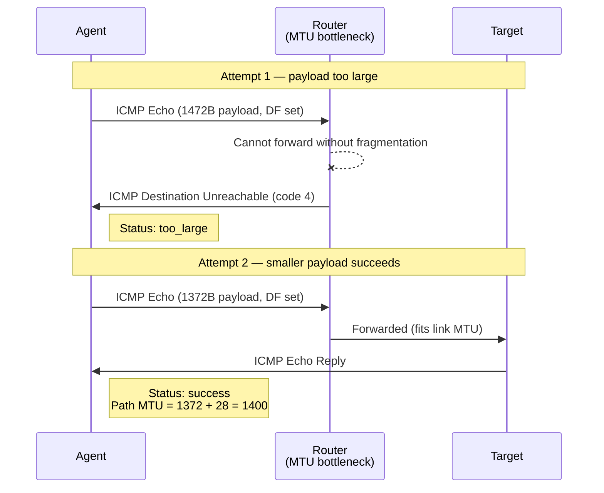
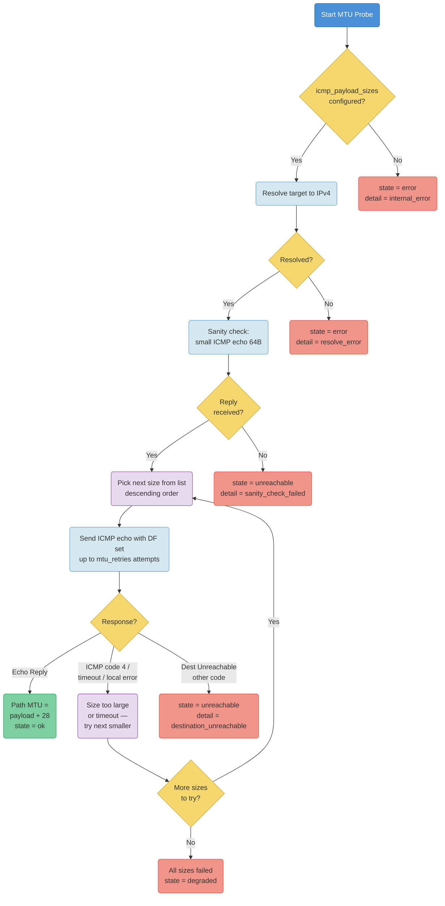
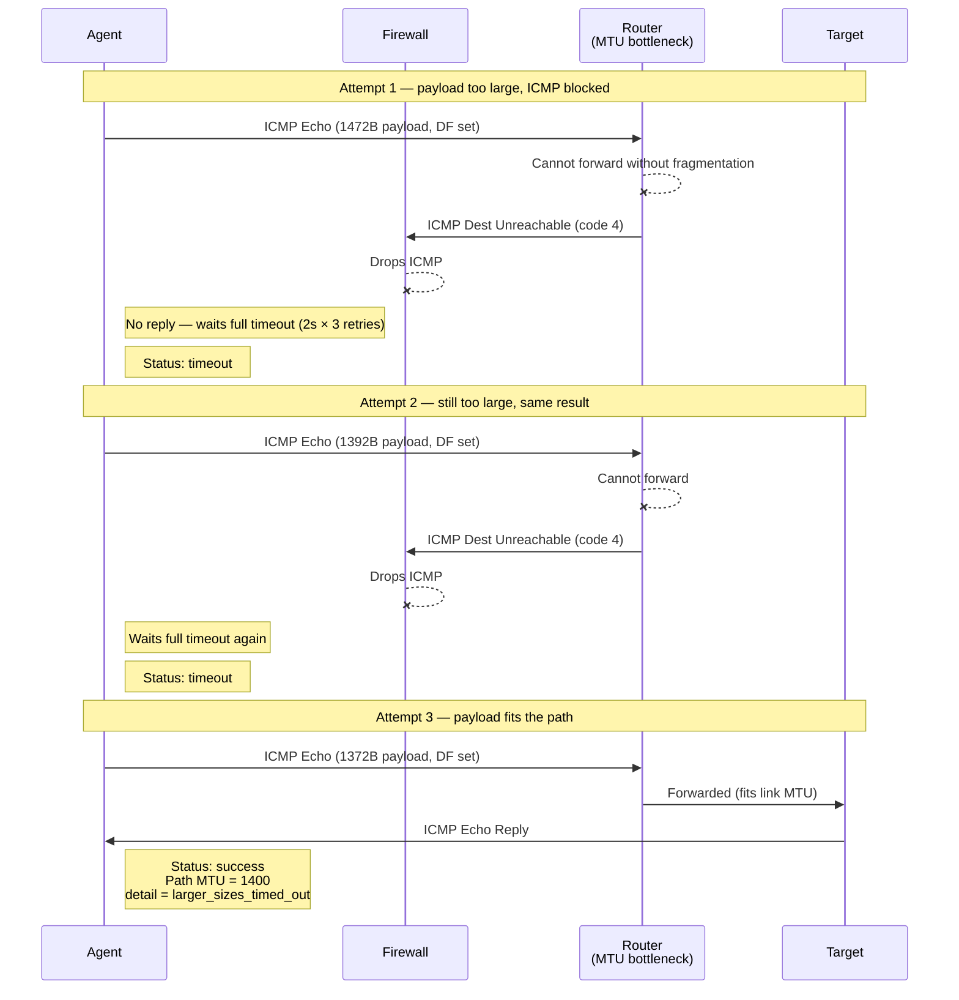

# MTU and PMTUD Probing Guide

## Table of Contents

- [Overview](#overview)
- [What MTU Means](#what-mtu-means)
- [How PMTUD Works](#how-pmtud-works)
- [How the Agent Implements MTU Probes](#how-the-agent-implements-mtu-probes)
- [ICMP Destination Unreachable Codes](#icmp-destination-unreachable-codes)
- [Network Requirements in Cloud Environments](#network-requirements-in-cloud-environments)
- [Linux Ping-Socket Backend](#linux-ping-socket-backend)
- [UDP Error Queue Alternative](#udp-error-queue-alternative)
- [Common PMTUD Problems](#common-pmtud-problems)
- [Interpreting Results](#interpreting-results)
- [Configuration Examples](#configuration-examples)
- [Local Internet Smoke Targets](#local-internet-smoke-targets)
- [Troubleshooting](#troubleshooting)

## Overview

The `mtu` probe estimates the largest IPv4 packet size that can cross the path between the agent and a target without fragmentation. It uses ICMP echo requests with the IPv4 Don't Fragment bit set, then steps down through configured payload sizes until one succeeds.

This probe is useful for finding path MTU problems across tunnels, VPNs, cloud networking, firewalls, NAT gateways, cross-region links, and private connectivity paths.

The current implementation is Linux-only and IPv4-only. IPv6 MTU probing needs
a separate design because ICMPv6 Packet Too Big uses different socket options
and error classification.

[Back to Table of Contents](#table-of-contents)

## What MTU Means

MTU means Maximum Transmission Unit. It is the largest packet size, in bytes, that can pass over a network link without fragmentation.

Common examples:

| Network path | Common MTU |
|---|---:|
| Standard Ethernet | 1500 |
| Some VPN or overlay paths | 1400 or lower |
| Jumbo-frame LAN paths | 9000, when enabled end to end |

For this agent's IPv4 ICMP probes:

```text
path MTU = ICMP payload size + 8 byte ICMP header + 20 byte IPv4 header
```

So an ICMP payload of `1472` corresponds to a path MTU of `1500`.
This calculation assumes a standard IPv4 header with no options. IPv4 headers
can be up to 60 bytes when options are present, which would reduce the payload
that fits inside the same path MTU.

[Back to Table of Contents](#table-of-contents)

## How PMTUD Works

Path MTU Discovery tries to discover the largest packet size that can traverse the whole route to a target.

For IPv4, the sender can set the DF bit, short for Don't Fragment. If a packet with DF set is too large for a link on the path, a router should drop the packet and return an ICMP Destination Unreachable message with code `4`, meaning fragmentation was needed but DF was set.

The normal flow is:



When a packet gets through and the agent receives an ICMP echo reply, that payload size is considered successful.

[Back to Table of Contents](#table-of-contents)

## How the Agent Implements MTU Probes



The agent's `mtu` probe:

- resolves the target as IPv4,
- opens a Linux unprivileged ICMP ping socket (`SOCK_DGRAM/IPPROTO_ICMP`),
- connects the socket to the target,
- enables `IP_RECVERR` so PMTUD errors are delivered through the socket error queue,
- enables IPv4 DF probing with `IP_MTU_DISCOVER` and `IP_PMTUDISC_PROBE`,
- sends a small ICMP echo sanity check before MTU tests,
- sends ICMP echo requests with configured payload sizes,
- tests sizes in descending order,
- retries each sanity and MTU attempt according to `mtu_retries`,
- stops at the first successful echo reply,
- reports the successful payload plus 28 bytes as the largest confirmed MTU.

`IP_PMTUDISC_PROBE` tells the Linux kernel to send DF probes without blocking the send only because of a cached PMTU value. The agent still interprets replies itself.

The sanity check uses the same ping-socket setup as MTU attempts. Its payload is small enough that DF probing does not change the intended meaning: if it fails, the agent does not run DF MTU tests because the ICMP echo path is not usable enough for MTU probing.

Default payload sizes:

```yaml
default_icmp_payload_sizes: [1472, 1392, 1372, 1272, 1172, 1072]
```

These correspond to path MTUs:

| ICMP payload | Path MTU |
|---:|---:|
| 1472 | 1500 |
| 1392 | 1420 |
| 1372 | 1400 |
| 1272 | 1300 |
| 1172 | 1200 |
| 1072 | 1100 |

The probe does not require `CAP_NET_RAW`. It requires `net.ipv4.ping_group_range` to include the process effective or supplementary GID so Linux allows unprivileged ICMP ping sockets.

On Linux ping sockets, the kernel manages the ICMP identifier and filters
traffic by connected peer. The probe still verifies Echo Reply sequence numbers.

[Back to Table of Contents](#table-of-contents)

## ICMP Destination Unreachable Codes

ICMPv4 Destination Unreachable is a broad message type. The code determines the real cause.

Examples:

| Code | Meaning | PMTUD interpretation |
|---:|---|---|
| 0 | Network unreachable | Network or routing failure |
| 1 | Host unreachable | Target or routing failure |
| 3 | Port unreachable | Not a packet-size signal |
| 4 | Fragmentation needed and DF set | Payload is too large, try smaller |
| 13 | Communication administratively prohibited | Policy or firewall block |

For PMTUD, only code `4` means "this payload is too large for the path". Other Destination Unreachable codes should not be treated as MTU-size failures because a smaller packet will usually not fix routing, reachability, or policy denial.

This matters for diagnosis. The agent treats code `4` as a size failure and treats other Destination Unreachable codes as a fatal reachability/policy signal for the probe: `state="unreachable", detail="destination_unreachable"`.

[Back to Table of Contents](#table-of-contents)

## Network Requirements in Cloud Environments

The current `mtu` probe does not require a TCP or UDP service on the target, but it is not network-policy-free. It depends on ICMP being usable end to end.

Required conditions:

- `net.ipv4.ping_group_range` includes the agent process effective or supplementary GID,
- the target can receive ICMP Echo Request packets from the agent,
- the target can send ICMP Echo Reply packets back to the agent,
- intermediate routers or virtual network devices can return ICMP Destination Unreachable code `4` when a DF packet is too large,
- security groups, firewall rules, network ACLs, and routing policy allow those ICMP replies and errors to return to the agent.

Some hardened hosts disable ping sockets with:

```text
net.ipv4.ping_group_range = 1 0
```

This is an empty range because the start is greater than the end. In that state,
ICMP and MTU socket creation fails with permission denied even for otherwise
healthy network paths.

In AWS, GCP, Azure, Kubernetes overlays, and VPN-heavy networks, these are explicit operational requirements. Blocking ICMP Echo can make the small sanity check fail. Blocking ICMP Destination Unreachable code `4` can turn a useful "payload too large" signal into a timeout. A timeout is weaker than a fragmentation-needed response because it can mean MTU trouble, ICMP filtering, packet loss, routing policy, or a target that does not answer ICMP.

For cloud deployments, treat the current ICMP MTU probe as a trade-off:

- it avoids opening a TCP or UDP application port on the target,
- it requires Linux ping-socket permission through `ping_group_range`,
- it requires ICMP Echo and ICMP error traffic to be allowed by cloud and host firewalls.

[Back to Table of Contents](#table-of-contents)

## Linux Ping-Socket Backend

The Linux implementation keeps the MTU probe ICMP-based without using raw ICMP sockets.

Linux has a special unprivileged ICMP Echo socket:

```text
socket(AF_INET, SOCK_DGRAM, IPPROTO_ICMP)
```

This is the same family of socket the agent already uses for regular ICMP probes through `icmp.ListenPacket("udp4", "0.0.0.0")`. It does not require `CAP_NET_RAW`; instead, the kernel allows or denies it through `net.ipv4.ping_group_range`.

The key discovery is that this ping socket can also be used with the PMTUD options needed by the MTU probe:

- enable `IP_MTU_DISCOVER` with `IP_PMTUDISC_PROBE` to send DF probes,
- enable `IP_RECVERR`,
- send ICMP Echo payloads of controlled size,
- read ICMP Echo Reply messages from the normal socket path,
- read ICMP Destination Unreachable / fragmentation-needed errors from the socket error queue with `recvmsg(..., MSG_ERRQUEUE)`.

That gives NetSonar a least-privilege MTU backend with the same operator-facing probe semantics:

| Event | Interpretation |
|---|---|
| ICMP Echo Reply for the probe sequence | Payload reached the target; size is confirmed |
| Error queue `SO_EE_ORIGIN_ICMP`, ICMP type `3`, code `4` | Fragmentation needed; payload is too large |
| Error queue `SO_EE_ORIGIN_LOCAL`, `EMSGSIZE` | Local kernel rejected the payload before sending |
| Timeout | No useful signal; could be ICMP filtering, loss, blackhole, or target silence |

This direction is better for NetSonar than a UDP-based PMTU probe because it avoids changing the network contract. Operators still only need ICMP Echo and ICMP error traffic; they do not need to open a UDP test port or run a UDP responder. In cloud environments, that matters: opening unsolicited UDP to every monitored host is often less acceptable than allowing scoped ICMP diagnostics.

The operational trade-off is:

```text
ping-socket backend: ping_group_range + ICMP reachability
```

The backend still does not solve ICMP filtering. If a VPN, firewall, security group, or cloud network device drops ICMP Echo Reply or fragmentation-needed messages, the result remains timeout or inconclusive. The improvement is privilege-related, not network-policy magic.

Empirical spike results on Linux confirmed the important kernel behavior:

- unprivileged ICMP socket creation succeeds once `ping_group_range` includes the process effective or supplementary GID,
- `IP_RECVERR` can be enabled on the ping socket,
- `IP_MTU_DISCOVER=IP_PMTUDISC_PROBE` can be enabled on the ping socket,
- normal ICMP Echo Reply is received through the normal read path,
- ICMP fragmentation-needed is delivered through `MSG_ERRQUEUE` with `SO_EE_ORIGIN_ICMP`, `type=3`, `code=4`, and an MTU value in `sock_extended_err.ee_info`,
- oversized local sends can produce `EMSGSIZE` with `SO_EE_ORIGIN_LOCAL`.

The backend uses one connected ping socket per attempt. That keeps error-queue
state isolated between payload sizes and lets the kernel provide the primary
peer filtering boundary.

[Back to Table of Contents](#table-of-contents)

## UDP Error Queue Alternative

Linux also supports a different PMTU technique used by tools such as `tracepath`: a process can open an ordinary UDP socket, enable `IP_RECVERR`, send packets with PMTUD enabled, and read ICMP errors from the socket error queue with `recvmsg(..., MSG_ERRQUEUE)`.

This is not implemented by the agent today. Since the ICMP ping-socket backend preserves the ICMP network contract without `CAP_NET_RAW`, UDP error-queue probing is a secondary option rather than the preferred MTU backend.

The basic interpretation would be:

| Signal | Meaning for a UDP PMTU probe |
|---|---|
| ICMP Destination Unreachable code `4` / fragmentation needed | Payload is too large for the path |
| Local `EMSGSIZE` | Local kernel or cached PMTU rejected the packet before send |
| ICMP Port Unreachable from the target | Datagram reached the target host; a closed UDP port is a useful success signal |
| UDP response from an application | Datagram reached the application; also a success signal |
| Timeout | Inconclusive; could be filtering, no application response, ICMP loss, packet loss, or PMTU black hole |

The surprising part is that a closed UDP port can be helpful. If the cloud firewall permits the UDP datagram to reach the target host and no service listens on that port, the target usually returns ICMP Port Unreachable. For PMTU probing that is a good end-of-path signal: the tested packet size reached the host.

However, a UDP error-queue probe has different cloud requirements from the ICMP ping-socket probe:

- the agent does not need `CAP_NET_RAW`,
- the network must allow UDP packets from the agent to reach the chosen target port, or the target application must answer,
- ICMP error messages must be allowed back to the agent,
- if a security group or network ACL silently drops UDP before it reaches the host, the probe will usually only see a timeout.

This makes UDP error-queue probing attractive only in environments where opening one UDP test port is easier than configuring `ping_group_range`. It is less attractive when cloud policy drops unsolicited UDP, because the result becomes inconclusive rather than a clear MTU measurement.

If implemented, this should be exposed as a separate backend or probe mode, not as an invisible replacement for the ICMP MTU probe. UDP and ICMP approaches have different operational requirements and different failure semantics.

[Back to Table of Contents](#table-of-contents)

## Common PMTUD Problems

### PMTUD Black Hole

A PMTUD black hole happens when oversized packets with DF set are dropped, but the ICMP error that should explain the drop is blocked or lost. The sender keeps sending packets that are too large and never learns the correct path MTU.



Symptoms can include:

- small requests work, large transfers hang,
- TCP connections establish but stall during larger responses,
- HTTPS handshakes or downloads fail inconsistently,
- direct traffic works but traffic through VPN, tunnel, NAT, or firewall fails.

### Impact on Probe Timing

When ICMP code 4 messages are lost, the probe cannot distinguish "too large" from "no reply". Each oversized payload must wait for the full per-attempt timeout multiplied by the retry count before the probe moves on to the next smaller size.

With default settings (`mtu_per_attempt_timeout: 2s`, `mtu_retries: 3`), each failing size costs up to 6 seconds. If four out of six configured sizes are too large for the path, that is 24 seconds of timeouts before the probe reaches a working size. If the target's global `timeout` is shorter than the accumulated wait, the probe will be cut short and report `state="degraded", detail="inconclusive"` instead of confirming the actual path MTU.

To reduce this cost in environments where ICMP code 4 is known to be blocked:

- increase the target `timeout` to allow enough time for the full size list,
- reduce `mtu_retries` (e.g. to 1 or 2) to shorten the wait per size,
- reduce `mtu_per_attempt_timeout` if the network latency is low,
- trim `icmp_payload_sizes` to only the sizes that are realistic for the path.

Example for a VPN path where the expected MTU is around 1400:

```yaml
targets:
  - name: vpn-mtu
    address: "10.10.20.30"
    probe_type: mtu
    interval: 300s
    timeout: 20s
    probe_opts:
      icmp_payload_sizes: [1372, 1272, 1172]
      mtu_retries: 2
      mtu_per_attempt_timeout: 2s
```

### ICMP Blocking

Firewalls and routers sometimes block ICMP entirely. That breaks PMTUD because ICMP Destination Unreachable code `4` is the feedback mechanism that tells senders to reduce packet size.

For the agent, blocked ICMP can mean:

- no echo replies,
- no fragmentation-needed messages,
- `probe_success=0`,
- no `probe_mtu_bytes` value,
- `probe_mtu_state{state="degraded", detail="all_sizes_timed_out"}`,
- logs showing timeout-like or all-sizes-failed behavior.

### Asymmetric Paths

The request path and response path can differ. A payload may reach the target, but the echo reply may not return over a working path. The probe measures end-to-end success from the agent's perspective, not a single link's MTU.

### Tunnel and Overlay Overhead

VPNs, GRE, IPsec, VXLAN, WireGuard, cloud overlays, and private connectivity services add headers. That reduces the effective MTU available to application traffic. A path that looks like Ethernet 1500 at the interface can have a lower usable MTU end to end.

[Back to Table of Contents](#table-of-contents)

## Interpreting Results

| Result | Meaning |
|---|---|
| `probe_mtu_state{state="ok", detail="largest_size_confirmed"} 1` and `probe_mtu_bytes=1500` | Payload 1472 succeeded, consistent with standard Ethernet MTU |
| `probe_mtu_state{state="ok", detail="fragmentation_needed"} 1` | A smaller payload succeeded after a larger payload received ICMP Destination Unreachable code 4 |
| `probe_mtu_state{state="ok", detail="larger_sizes_timed_out"} 1` | A smaller payload succeeded, but larger payloads timed out; this is weaker than a verified fragmentation-needed signal |
| `probe_mtu_state{state="degraded", detail="local_message_too_large"} 1` | The local host/kernel rejected one or more probe packets before sending them |
| `probe_mtu_state{state="degraded", detail="all_sizes_timed_out"} 1` | No configured payload size succeeded and the attempts timed out |
| `probe_mtu_state{state="degraded", detail="inconclusive"} 1` | The global probe deadline expired before the agent could confirm a size |
| `probe_mtu_state{state="unreachable", detail="sanity_check_failed"} 1` | The small ICMP echo sanity check did not get a reply |
| `probe_mtu_state{state="unreachable", detail="destination_unreachable"} 1` | ICMP Destination Unreachable code other than 4 was received; likely reachability, routing, or policy, not MTU size |
| `probe_mtu_state{state="error", detail="permission_denied"} 1` | `ping_group_range` excludes the process effective and supplementary GIDs |
| `probe_mtu_state{state="error", detail="resolve_error"} 1` | Target did not resolve to IPv4, or resolution failed |

`probe_mtu_bytes` is only set when a size was confirmed. When no MTU was
confirmed, the series is absent. Use `probe_mtu_state` for the diagnostic reason.

If a size was confirmed but it is below `expected_min_mtu`, the probe reports a
`degraded` MTU state and `probe_success=0`. The path is reachable, but it does
not satisfy the configured minimum MTU expectation.

### MTU State and Detail Reference

`probe_mtu_state` uses a small, fixed set of `state` and `detail` label values.
The metric value is always `1`; the labels carry the diagnostic result.

| State | Detail | Meaning | Typical cause |
|---|---|---|---|
| `ok` | `largest_size_confirmed` | The largest configured payload size succeeded. | The path supports the largest MTU tested by this target. |
| `ok` | `fragmentation_needed` | A smaller payload succeeded after a larger payload received ICMP fragmentation-needed. | The path MTU is lower than the largest tested size, and PMTUD feedback is working. |
| `ok` | `larger_sizes_timed_out` | A smaller payload succeeded, but one or more larger payloads timed out first. | The path probably has a smaller MTU, but ICMP fragmentation-needed may be filtered. |
| `ok` | `local_message_too_large` | A smaller payload succeeded after the local host rejected a larger payload before sending it. | Local interface or route MTU is lower than the larger tested size. |
| `degraded` | `largest_size_confirmed` | A payload succeeded, but the confirmed MTU is below `expected_min_mtu`. | The path works, but does not meet the configured minimum MTU expectation. |
| `degraded` | `fragmentation_needed` | A smaller payload succeeded after fragmentation-needed feedback, but the confirmed MTU is below `expected_min_mtu`. | Real path MTU is lower than the configured expectation. |
| `degraded` | `larger_sizes_timed_out` | A smaller payload succeeded after larger timeouts, but the confirmed MTU is below `expected_min_mtu`. | Path may be below expectation and PMTUD feedback may be blocked. |
| `degraded` | `below_min_tested` | No configured payload size succeeded, and at least one tested size was reported too large. | The path MTU is below the smallest configured test size, or PMTUD feedback was received but no usable size was tested. |
| `degraded` | `all_sizes_timed_out` | No configured payload size succeeded; all MTU attempts timed out. | ICMP echo or fragmentation-needed feedback may be filtered, or the target/path is not responding to MTU probes. |
| `degraded` | `local_message_too_large` | The local host rejected one or more MTU probe packets before sending them, and no acceptable size was confirmed. | Local route/interface MTU is lower than the configured sizes, or configured sizes are too large. |
| `degraded` | `inconclusive` | The global probe deadline expired before the probe could confirm a final result. | Target timeout is too short for the configured sizes, retries, and per-attempt timeout. |
| `unreachable` | `sanity_check_failed` | The small initial ICMP echo sanity check did not get a reply. | Target does not answer ICMP echo, ICMP is filtered, or the target/path is unreachable. |
| `unreachable` | `destination_unreachable` | ICMP Destination Unreachable other than fragmentation-needed was received. | Routing, firewall, host policy, or network reachability problem unrelated to MTU size. |
| `error` | `permission_denied` | The agent could not open or use the required ICMP socket. | `ping_group_range` excludes the process effective and supplementary GIDs, or host policy blocks ping sockets. |
| `error` | `resolve_error` | The target could not be resolved to an IPv4 address. | DNS failure, hostname with no IPv4 address, or invalid runtime resolver configuration. |
| `error` | `internal_error` | The prober hit an unexpected local error. | Socket setup, packet encoding, or other implementation/runtime error not covered by a more specific detail. |

`probe_mtu_state{state, detail}` is the public diagnostic source of truth for MTU
outcomes. Algorithm-level details such as fragmentation-needed hits, individual
attempt timeouts, retries, and local EMSGSIZE events are internal probe behavior;
use debug logs for that level of detail rather than Prometheus counters.

The confirmed MTU is only as granular as the configured payload list. With the default list, the agent can distinguish 1500, 1420, 1400, 1300, 1200, and 1100 byte paths. It does not binary-search every possible MTU value.

### Metric Values by MTU State

The following table summarises which metric values are emitted for each MTU state category:

| State | `probe_success` | `probe_mtu_bytes` | `probe_mtu_state` | `probe_icmp_avg_rtt_seconds` | `probe_duration_seconds` |
|---|---|---|---|---|---|
| `ok` | 1 | confirmed MTU (e.g. 1500) | `{state="ok", detail="..."}` = 1 | avg RTT from successful ICMP echoes | full probe duration |
| `degraded` (below `expected_min_mtu`) | 0 | confirmed MTU (e.g. 1400) | `{state="degraded", detail="..."}` = 1 | avg RTT from successful ICMP echoes | full probe duration |
| `degraded` (no size confirmed) | 0 | absent | `{state="degraded", detail="..."}` = 1 | avg RTT from sanity echo (if successful) | full probe duration |
| `unreachable` | 0 | absent | `{state="unreachable", detail="..."}` = 1 | absent (no successful echoes) | full probe duration |
| `error` | 0 | absent | `{state="error", detail="..."}` = 1 | absent (no successful echoes) | full probe duration |

Key points:
- `probe_mtu_bytes` is only present when at least one payload size was confirmed. Use `probe_mtu_state` to diagnose why it is absent.
- `probe_icmp_avg_rtt_seconds` is the average RTT across all successful ICMP echo replies (sanity echo and step-down payloads). It is absent when no echo reply was received.
- `probe_success=0` with `state="degraded"` and a non-absent `probe_mtu_bytes` means the path works but MTU is below `expected_min_mtu`.

[Back to Table of Contents](#table-of-contents)

## Configuration Examples

Use defaults:

```yaml
agent:
  default_interval: 30s
  default_timeout: 5s
  default_icmp_payload_sizes: [1472, 1392, 1372, 1272, 1172, 1072]

targets:
  - name: api-mtu
    address: "api.example.internal"
    probe_type: mtu
    interval: 300s
    timeout: 30s
```

Use custom payload sizes:

```yaml
targets:
  - name: vpn-mtu
    address: "10.10.20.30"
    probe_type: mtu
    interval: 300s
    timeout: 30s
    probe_opts:
      icmp_payload_sizes: [1392, 1372, 1272, 1172, 1072, 972]
      expected_min_mtu: 1420
      mtu_retries: 3
      mtu_per_attempt_timeout: 2s
```

Payload sizes must be sorted in descending order. `expected_min_mtu` must not be larger than the largest tested MTU (`max(icmp_payload_sizes) + 28`). The agent stops at the first successful size.

### Choosing `expected_min_mtu`

Without `expected_min_mtu`, the probe reports `probe_success=1` as long as any payload size succeeds — even if path MTU drops from 1500 to 1100. Set `expected_min_mtu` to get alerted when MTU degrades below the expected value for a given network path:

| Network path | Recommended `expected_min_mtu` | Reason |
|---|---|---|
| Same-region (direct) | 1500 | Standard Ethernet MTU |
| Cross-region via WireGuard | 1420 | WireGuard overhead (80 bytes) |
| Cross-region via IPsec/GRE | 1400 | Typical tunnel overhead |
| Internet / unknown path | omit or 1200 | Conservative; avoids false alerts |

Common scenarios where `expected_min_mtu` catches real problems:
- Routing change pushes traffic through a tunnel with lower MTU
- VPN/overlay misconfiguration reduces path MTU
- Cloud provider underlay change affects encapsulation overhead

Setting `expected_min_mtu` too high for a tunnelled path will cause persistent false alerts. Match the value to the expected MTU of the specific network path.

`mtu_per_attempt_timeout` bounds each individual sanity or MTU attempt. The target `timeout` remains the global deadline for the whole probe.

[Back to Table of Contents](#table-of-contents)

## Local Internet Smoke Targets

The optional dev-stack Internet config includes low-frequency MTU smoke probes:

```sh
make lab-dev-internet
```

Those probes target public anycast or measurement-friendly addresses:

| Target | Purpose |
|---|---|
| `1.1.1.1` | Cloudflare public DNS anycast |
| `8.8.8.8` | Google Public DNS anycast |
| `9.9.9.9` | Quad9 public DNS anycast |
| `ping.ripe.net` | RIPE connectivity/ping target |

These are not a public MTU benchmark and should not be used as CI assertions.
They are best-effort egress checks for local development. A failure can mean a
real PMTUD problem, but it can also mean local firewall policy, Docker host
networking, VPN policy, upstream ICMP filtering, anycast routing, or ICMP
rate-limiting. Treat them as diagnostic signals alongside TCP, HTTP, DNS, and
TLS probes in the same `lab-dev-internet` stack.

[Back to Table of Contents](#table-of-contents)

## Troubleshooting

| Symptom | Likely Cause | Fix |
|---|---|---|
| Config rejects an IPv6 literal | MTU probes are IPv4-only | Use an IPv4 target or add IPv6 MTU support as a separate feature |
| `probe_mtu_state{state="degraded", detail="all_sizes_timed_out"}` | All configured sizes timed out, ICMP may be blocked, or minimum configured size is still too large | Check agent logs, routing, firewall rules, and try smaller payload sizes |
| `probe_mtu_state{state="unreachable", detail="sanity_check_failed"}` | The target did not answer the small ICMP echo sanity check | Check whether ICMP echo is allowed end to end and whether the host is reachable |
| `probe_mtu_state{state="unreachable", detail="destination_unreachable"}` | The network returned Destination Unreachable code other than 4 | Check routing, target reachability, firewall policy, and ICMP filtering |
| `probe_mtu_state{state="degraded", detail="local_message_too_large"}` | Local host/kernel rejected a probe before sending it | Check local interface MTU, routes, and host networking |
| Permission error in logs | `ping_group_range` excludes the process effective and supplementary GIDs | Set `net.ipv4.ping_group_range` to include the service GID |
| Small traffic works but large traffic hangs | Possible PMTUD black hole | Allow ICMP Destination Unreachable code 4 through firewalls and check tunnel MTU |
| MTU looks lower over VPN or overlay | Encapsulation overhead | Configure lower payload sizes or adjust tunnel/interface MTU |

Useful `ping_group_range` fixes:

```bash
# Production: allow only the netsonar service GID.
GID=$(getent group netsonar | cut -d: -f3)
sudo sysctl -w net.ipv4.ping_group_range="$GID $GID"

# Typical development range used by many Linux distributions.
sudo sysctl -w net.ipv4.ping_group_range="0 2147483647"

# Full kernel GID range for ping sockets. 4294967295 is intentionally excluded.
sudo sysctl -w net.ipv4.ping_group_range="0 4294967294"
```

For containers and Kubernetes, `ping_group_range` is network-namespaced. Set it
inside the container or pod network namespace, not only on the host namespace.
See [Container Deployment](container-deployment.md) for Docker and Kubernetes
examples.

[Back to Table of Contents](#table-of-contents)
